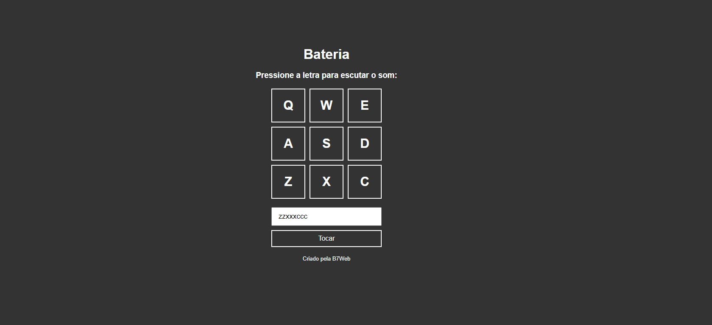

# BATERIA MUSICAL -  JAVASCRIPT - ES6

- Bateria musical virtual, passando por eventos do teclado e outros assuntos JS.

## Stack utilizada

**Front-end:** HTML, Javascript e CSS.

## Screenshots

## Funcionalidades

- Simula uma bateria musical, ao pressionar as respectivas teclas são emitidas determinados sons.

- No imputi é possível inserir via teclado as letras e assim tocar os sons clicando no botão Tocar.

## Referência

 - [Plataforma de cursos B7](https://alunos.b7web.com.br/login)

